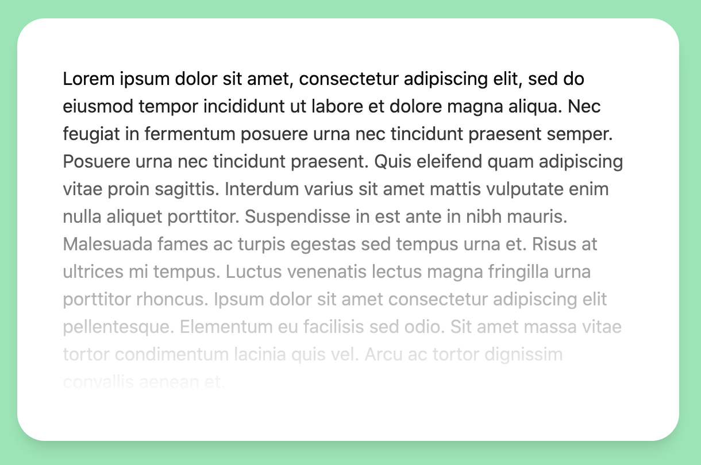

# Gradient Mask plugin for Tailwind CSS

Tailwind CSS plugin for adding `mask-image` with a `linear-gradient` on a HTML element.



Try it out in [Tailwind CSS Playground](https://play.tailwindcss.com/ZAQrbYa3wH)

[MDN docs on mask-image](https://developer.mozilla.org/en-US/docs/Web/CSS/mask-image)

## Installation

With npm
```bash
npm install tailwind-gradient-mask-image
```

With yarn
```bash
yarn add tailwind-gradient-mask-image
```

## Configuration

Add the plugin to your `tailwind.config.js`

```js
{
    plugins: [require("tailwind-gradient-mask-image")]
}
```

## Usage

```html
<div class="gradient-mask-t-0">
    ...
</div>
```

The plugin creates classes with prefix `gradient-mask-`. After the prefix follows a direction shorthand and the gradient start percentage.

The class above matches the css
```css
.class {
    mask-image: linear-gradient(to top, rgba(0, 0, 0, 1.0) 0%, transparent 100%);
}
```


## Variations

Direction shorthands
```js
{
  t: "to top",
  tr: "to top right",
  r: "to right",
  br: "to bottom right",
  b: "to bottom",
  bl: "to bottom left",
  l: "to left",
  tl: "to top left",
}
```

The gradient start percentages go from 0% to 100% with 10% gaps.

